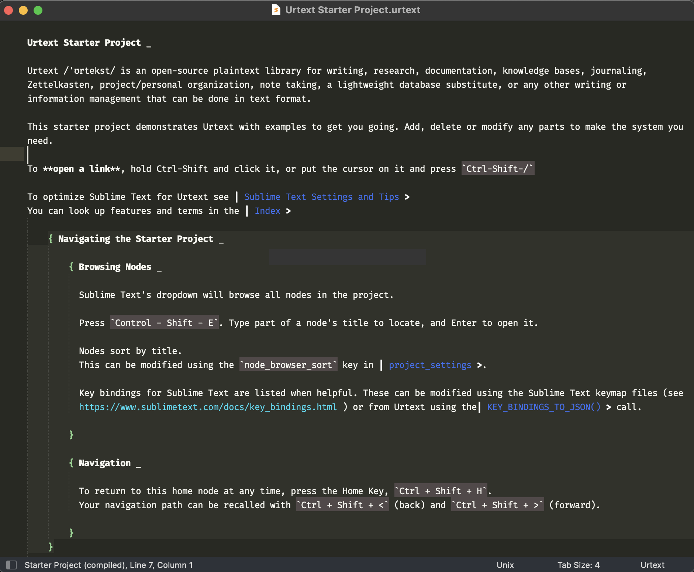

# Urtext Package for Sublime Text

## What Urtext Is

Urtext /ˈʊrtekst/ is an open-source library for plaintext writing, research, documentation, knowledge bases, journaling, Zettelkasten, project/personal organization, note taking, a lightweight database substitute, or any other writing or information management that can be done in text format.

The core library has no user interface and requires a text editor implementation. This package is an implementation for desktop (PC/Mac/Linux) using [Sublime Text](https://www.sublimetext.com/).

## Installation

### Using Package Control

***For experienced Sublime Text users, note this package is no longer updated on [packagecontrol.io](https://urtext.co/installation-and-setup/sublime-text/installation-and-setup-in-sublime-text/) and has its own Package Control channel.***

See instructions at https://urtext.co/setup/sublime-text/.

### With Git:

Clone this repository into the Sublime Text Packages folder. (See above for the folder location depending on operating system.)

## Starter Project & Documentation

- Restart Sublime Text
- Press ⌘/Ctrl + ⇧ + P to access the Command Pallete. 
- Start typing "Urtext: Create Starter Project" and select it from the dropdown
- Select a folder for the starter project
- The project will open and display its start page.

See https://urtext.co/documentation/ for more information.

## Implementations

There is also an implementation for iOS using [Pythonista](https://omz-software.com/pythonista/), [urtext_pythonista](https://github.com/nbeversl/urtext_pythonista).

## Questions and Issues

Questions and issues may be submitted either to https://urtext.co/support/ or to https://github.com/nbeversl/UrtextSublime/issues.

